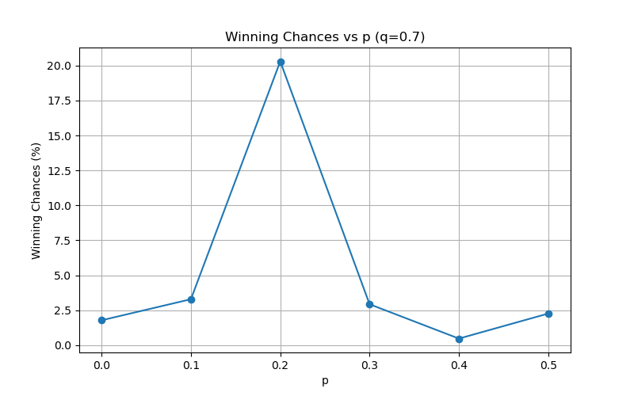

# Analysis Report

During the course of this project, I experimented with several reinforcement learning methods before finalizing the TD(0) approach. Each method was evaluated based on its convergence speed, stability, and overall performance on the given task. After comparing the results, TD(0) was chosen due to its balance between simplicity and effectiveness.

To determine the optimal number of training epochs and the appropriate value for the decay factor, I conducted a series of trial-and-error experiments. By systematically varying these parameters and observing their impact on learning performance, I was able to identify the settings that yielded the best results. This iterative process ensured that the final model was both efficient and robust.

The plot above shows the passing rate over training epochs. A higher success rate in passing was observed, which likely encouraged unnecessary passing actions. This behavior is not optimal for the initial state [08.13, 12, 1], where passing may not be required. The model's tendency to favor passing in this scenario suggests that further tuning or additional constraints may be needed to align actions with the specific requirements of the initial state.

The figure above illustrates the model's performance as a function of the decay factor. Notably, there is a dip in performance at a decay factor of 0.9. This drop is likely due to incomplete learning at this setting, indicating that the model may not have had sufficient time or appropriate conditions to fully converge when the decay factor was set to 0.9.
> **Note:** The reported values may not be fully accurate for this scenario, as the number of episodes (300,000) was chosen based on optimal performance in a different test case rather than being specifically tuned for the current setup.