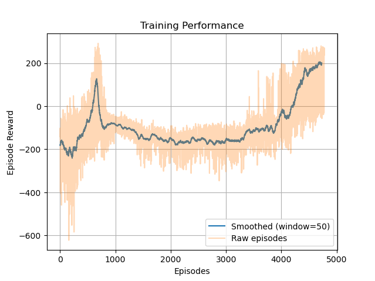
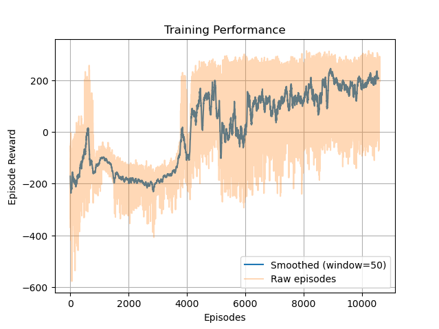

# Gymnasium:Lunar Lander
## Problem statement: 
https://gymnasium.farama.org/environments/box2d/lunar_lander/

An episode is considered to be successful if it results in a cumulative reward of >=200.

## Analysis
After getting familiarized with the environment and learning about all the different parameters involved, I decided to implement Actor-Critic Policy Control (file: simple_AC.py).

Some of the key learnings/discoveries/features are:
* Actual implementation of neural networks using PyTorch
* Manual implementation of gradients and eligibility traces (TD error implementation of the advantage function)
* Implementation of Softmax using logits instead of an explicit score function

However, this method was quite slow and the predicted time for completion was high.

Hence, I decided to modify my logic slightly and ended up implementing a version of the A2C algorithm:

* To speed up, I switched to the GPU and implemented several synchronous agents instead of a single agent
* Next, I removed the eligibility traces and used the in-built Adam optimizer for gradient calculation. This simplified the logic and reduced the computation per episode (with the tradeoff of requiring more episodes)
* Lastly, instead of updating after every episode, I introduced batches

All weights and biases are included in the checkpoint.pt files.

## Observations

    

<em>Training ended when avg reward of last 100 episodes exceeded 200</em>

    

<em>Training ended when avg reward of last 500 episodes exceeded 200</em>

### An inrersting general observation: 
In general for policy gradient methods , I have obsereved that the learning curve starts out flat for a major chunk and the majority of the progress happens almost suddenly. 